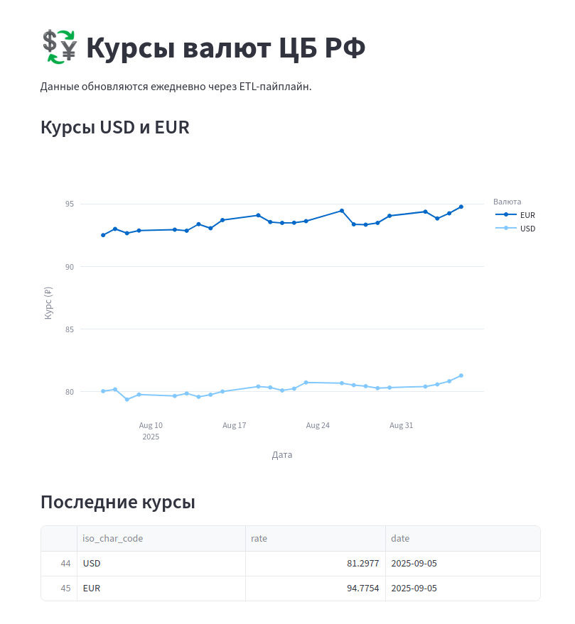

# cbr-etl-project

Демонстрационный проект загрузки данных.

1 Исходные данные лежат на сайте Центробанка РФ https://www.cbr.ru/development/ "Технические ресурсы" → "Получение данных, используя XML". С помощью скрипта etl/etl_cbr_exchange_rates.py данные загружаются в БД postgresql. Скрипт etl_cbr_exchange_rates.py запускается ежедневно с помощью Github Actions. Здесь предусматрена обработка данных - фильтрация, трансформации. В промышленном окружении такого рода скрипты запускаются в Apache airflow и могут использовать spark для обработки данных. В данном случае используется только модуль pandas.

2 База данных postgresql, в которую складываются данные, предоставлена сервисом render.com, структура таблиц в файле db/ddl.sql.

3 Загруженные данные визуализируются на дашборде с помощью библиотеки Streamlit. Дашборд хостится на Streamlit Community Cloud, код в файле bi/streamlit_app.py, адрес: https://cbr-etl-project.streamlit.app

## 🏗️ Как это устроено

1. 📥 **Extract**: Данные забираются с `cbr.ru` (XML).
2. 🧹 **Transform**: Очищаются и фильтруются в `pandas`.
3. 💾 **Load**: Сохраняются в PostgreSQL на Render.com.
4. 📊 **Visualize**: Дашборд на Streamlit.
5. 🔄 **Schedule**: Запуск через GitHub Actions (ежедневно).

## 🛠️ Возможные улучшения

- 🔁 Перейти на **Airflow** для оркестрации.
- 📈 Добавить **метрики ЦБ РФ** (ключевая ставка, инфляция, объём денежной массы).
- 🔄 Использовать **Supabase** как постоянное хранилище.
- 📦 Собрать всё в **Docker**.
- 🧪 Добавить **unit-тесты**.
- 🔐 Использовать **Hashicorp Vault** для управления секретами.

### Другие данные доступные на сайте ЦБ РФ
* Ключевая ставка https://cbr.ru/Queries/UniDbQuery/ValuesRu?From=01.01.2020&To=01.01.2025&P=2510
* Инфляция https://cbr.ru/Queries/UniDbQuery/ValuesRu?P=261
* Объём денежной массы (М2) https://cbr.ru/Queries/UniDbQuery/ValuesRu?P=271
* Реестр банков https://www.cbr.ru/credit/Institut/

